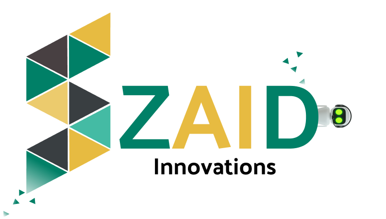

# Syed Muhammad Zaid - Github Profile | SYED ZAID's INNOVATIONS

## Welcome to My GitHub Playground! 🚀👋

Syed Zaid's Innovation is a dynamic and forward-thinking technology company founded and led by Syed Muhammad Zaid. Our mission is clear: to innovate, create, and explore the ever-evolving world of technology. We welcome collaborations, challenges, and opportunities to code a brighter future.

Join us on this exciting journey, where innovation knows no bounds, and together, we'll redefine what's possible in the world of tech.

## 🚀 About Me

I'm Syed Muhammad Zaid, an undergraduate Software Engineer with a deep passion for the world of technology. I thrive on the challenge of turning innovative ideas into functional software solutions that make a difference.

- 🐍 I have a strong command of Python and its versatile framework, Django, allowing me to build robust and scalable web applications. I enjoy working on both the backend logic and the frontend user experiences.

- 🌐 My skills extend to HTML, CSS, and JavaScript, enabling me to craft visually appealing and responsive frontends that engage users effectively.

- 🤖 I've recently worked on object detection models. Teaching machines to understand and interact with their environment is a captivating journey.

- 🎨 Beyond coding, I'm passionate about UI/UX design and express my creativity using Figma. My goal is to create user interfaces that not only look beautiful but also offer intuitive and enjoyable experiences.

 

## My Code Language Proficiencies

 

## 🔗 Explore My Digital Presence

<!--  -->

## 
